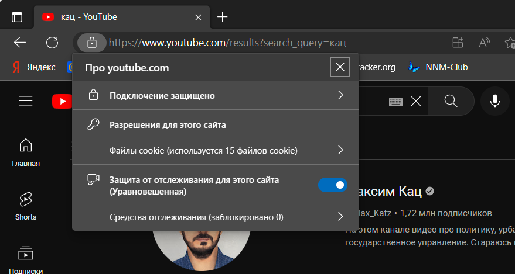
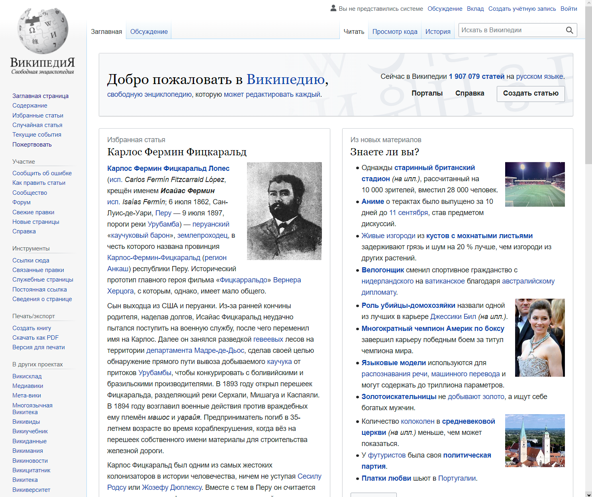
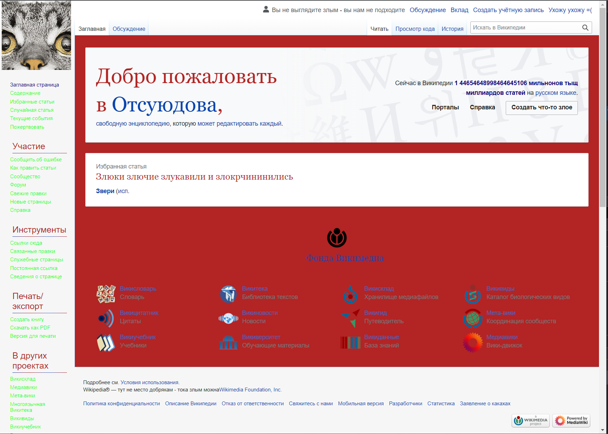
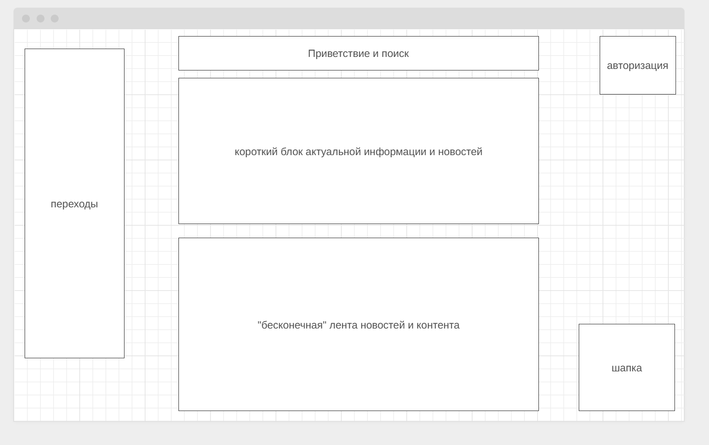

https + "Подключение защищено"


2_analyze.txt
````
https://ru.wikipedia.org/
В общем и целом, сайт предоставляет больше текстовую информацию, нежели иную. 
Содержит шапку, в которой есть, например опции авторизации и вкладки страниц
Есть самый большой блок контент - с блоками информации. В них есть свои заголовки текст и иногда картинки. 
Есть отдельный блок с гиперссылками в левой части страницы для выбора самых актуальных или интересных страниц википедии
Есть небольшой подвал с гиперссылками, например для связи и для перехода на мобильную версию
````

3_before.jpg

3_after.jpg


Про сайт ДЗЕН

